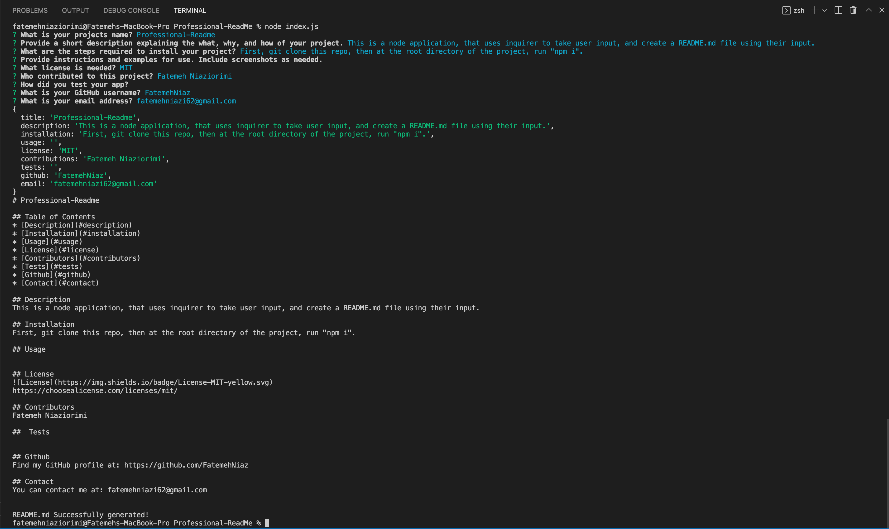

# Professional-Readme

## Table of Contents
* [Description](#description)
* [Installation](#installation)
* [Usage](#usage)
* [License](#license)
* [Contributors](#contributors)
* [Github](#github)
* [Contact](#contact)

## Description
This is a node application, that uses inquirer to take user input, and create a README.md file using their input.

## Installation
First, git clone this repo, then at the root directory of the project, run "npm i".

## Usage

## License
\
https://choosealicense.com/licenses/mit/

## Contributors
Fatemeh Niaziorimi

## Github
Find my GitHub profile at: https://github.com/FatemehNiaz

## Contact
You can contact me at: fatemehniazi62@gmail.com

